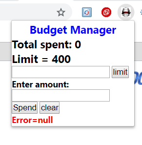
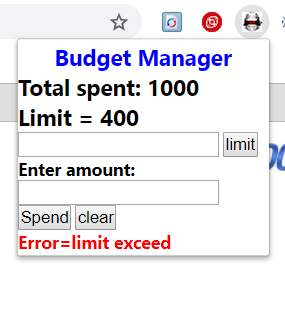
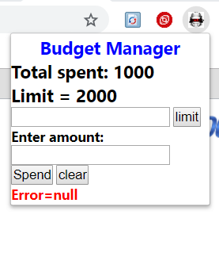

# Budget-Manager
It is an extension to manage our daily budgets

“Budget Manager” extension: 
This google chrome extension is used to manage the user’s budget. 
How the extension was developed:
1)	First I created the “manifest.json” file. 
2)	Then I made the Basic HTML and CSS popup for the extension
3)	Thereafter I wrote the JavaScript file in which I transferred and stored the value of Budget Limit and Amount spent. The inputted data was retrieved every time the popup was opened. The above data was automatically modified & updated whenever the information on Budget limit is changed and/ or Amount spent is updated.
4)	On basis of the above information, I also added an error “limit exceed” that informs that the expenditure has exceeded the limit that has been set.
Screen shots: 
  
  
  
 
